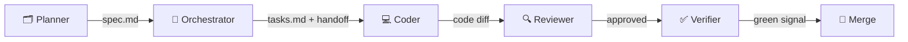

# Agents Reference

> **What is an "agent" here?** An agent is an AI model (like Claude, Cursor, or Copilot) given a specific role, a set of input files, and clear constraints — so it behaves predictably within a defined boundary.

This cookbook uses a **five-agent pod** model. Each role has a distinct responsibility and a clear handoff protocol. No single agent does everything.

---

## The Five-Agent Pod

| Role | One-Line Job | Triggered By |
|---|---|---|
| **Planner** | Turns a human's idea into a verified, testable spec | `/speckit.specify`, `/speckit.clarify` |
| **Orchestrator** | Routes work between roles; enforces the Spec-Kit → Superpowers boundary | Session startup, task transitions |
| **Coder** | Implements each task with TDD (RED → GREEN → REFACTOR) | `subagent-driven-development` skill |
| **Reviewer** | Checks spec compliance first, code quality second | `requesting-code-review` skill |
| **Verifier** | Runs all automated gates before merge | `verification-before-completion` skill |

---

## Role Summaries

### 🗂️ Planner
Translates human intent into `spec.md` acceptance criteria. Runs `/speckit.clarify` to flush ambiguities *before* planning. Every criterion must be mechanically verifiable.

**Key rule:** Does not proceed to plan generation without explicit user approval on acceptance criteria.

### 🔀 Orchestrator
Loads context at session start, routes tasks to the correct agent, and enforces the handoff boundary between Spec-Kit and Superpowers. Escalates blocked states to the user rather than guessing.

**Key rule:** Issues the standard handoff message (see [Greenfield Guide](./docs/greenfield.md) or [Brownfield Guide](./docs/brownfield.md)) only after `tasks.md` is confirmed ready.

### 💻 Coder
Executes the TDD loop for each task: write a failing test → write minimum code to pass → refactor. Appends an execution log entry to `.ai/traces/AGENT_LOG_REFLECTIONS.md` after every session.

**Key rule:** Writes minimum code only. No gold-plating, no unrequested abstractions.

### 🔍 Reviewer
Two-stage review: (1) spec compliance — does the output satisfy every acceptance criterion? (2) code quality — is it clean, minimal, consistent with the existing style? Blocks on critical issues; fixes minor ones inline.

**Key rule:** Stage 1 must pass before Stage 2 begins.

### ✅ Verifier
Runs all gates defined in `.ai/config/VERIFICATION_AND_EVAL_GUIDE.md`. Catches phantom completions. Triggers a postmortem entry if any gate fails before merge.

**Key rule:** Gate failure halts the branch. Logs to postmortems before surfacing the violation to the user.

---

## Detailed Profiles

Full role specifications — including inputs, outputs, and handoff protocols — are in:

→ [`.ai/config/AGENT_PROFILE_ROLES.md`](./.ai/config/AGENT_PROFILE_ROLES.md)

---

## Command & Skill Mapping

| Role | Spec-Kit Commands | Superpowers Skills |
|---|---|---|
| Planner | `/speckit.specify`, `/speckit.clarify`, `/speckit.analyze` | — |
| Orchestrator | `/speckit.tasks` (triggers handoff) | Session startup routing |
| Coder | — | `subagent-driven-development`, `test-driven-development` |
| Reviewer | — | `requesting-code-review` |
| Verifier | — | `verification-before-completion`, `finishing-a-development-branch` |
