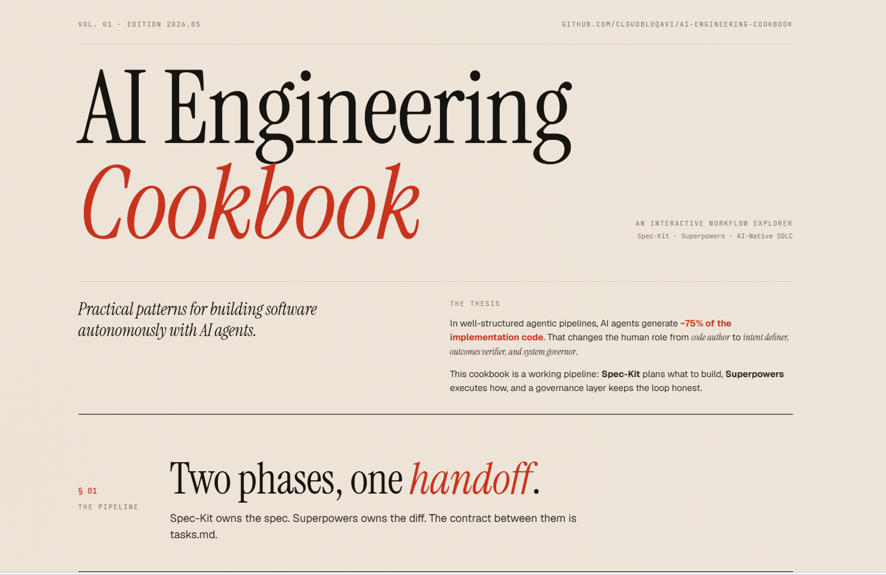
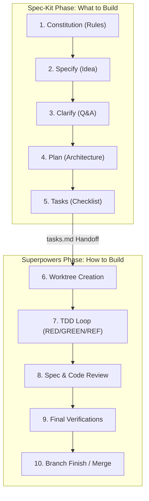

# AI Engineering Cookbook

Practical patterns, structures, and guidelines for building software autonomously with AI agents. 

This cookbook provides an opinionated engineering workflow that combines **[Spec-Kit](https://github.com/github/spec-kit)** for planning ("what to build") and **[Superpowers](https://github.com/obra/superpowers)** for execution ("how to build it"), augmented with curated community extensions and an AI governance layer.

---

## 🤔 New Here? What Is AI-Native Engineering?

AI-Native Engineering is a development approach where **AI agents write the majority of the code** — but humans stay firmly in control by defining clear intent upfront and verifying outcomes rigorously.

Think of it this way: instead of writing code yourself, you write a precise *specification* of what the code should do. An AI agent then implements it, test by test, under strict constraints you set. Your role shifts from **code author** to **intent definer and outcomes verifier**.

This cookbook gives you the workflow, tools, and guardrails to do that safely and repeatably.

> **New to this?** Follow the [Learning Path](#%EF%B8%8F-learning-path-start-here) below before diving into the guides. Don't know a term? Check the [Glossary](./GLOSSARY.md).

---

## 🎨 Interactive Cookbook Explorer

The AI Engineering Cookbook is accompanied by a modern, interactive web application that provides a comprehensive visual walkthrough of the entire agentic SDLC workflow, agent profiles, verification gates, and community extensions.

👉 **[Explore the Interactive Cookbook Explorer](https://cloudbloqavi.github.io/ai-engineering-cookbook/design/cookbook-explorer.html)** (hosted on GitHub Pages, or view the [local code and guides](./design/README.md))

---

## 🗺️ Visual SDLC Workflow

The diagram below shows how the workflow is split: Spec-Kit manages specification and planning, while Superpowers drives isolated test-driven implementation.

---

## 📚 Cookbook Documentation Directory

| Guide | Description | Key Focus |
| :--- | :--- | :--- |
| **🎨 [Cookbook Explorer](https://cloudbloqavi.github.io/ai-engineering-cookbook/design/cookbook-explorer.html) ([Local](./design/README.md))** | Interactive visual companion to explore the cookbook. | Interactive SDLC, agents, verification gates, and extensions |
| **🚀 [Quickstart Guide](./QUICKSTART.md)** | Start here! Launch your first AI-native feature in 5 minutes. | CLI cheatsheet, 3-step setup |
| **📦 [Installation & Setup](./docs/installation.md)** | Prerequisites and global configuration steps. | uv, specify-cli, plugins |
| **🌱 [Greenfield Workflows](./docs/greenfield.md)** | Building new features and applications from scratch. | Next.js Expense Tracker example |
| **🍂 [Brownfield Workflows](./docs/brownfield.md)** | Safe development in legacy or existing codebases. | Express.js JWT Auth example |
| **🛡️ [AI Governance & Observability](./docs/governance.md)** | The SDLC flywheel, logs, postmortems, and agent roles. | reflections, blameless logs |
| **🧩 [Community Extensions](./docs/extensions.md)** | 20 curated plugins to enhance security, scope, and testing. | Extension maps, decision guide |
| **🔧 [Troubleshooting](./docs/troubleshooting.md)** | Common failure scenarios and step-by-step fixes. | Install errors, TDD issues, phantom completions |
| **📖 [Glossary](./GLOSSARY.md)** | Plain-English definitions for every key term. | 30+ terms from AI Agent to Worktree |
| **🤝 [Contributing](./CONTRIBUTING.md)** | How to improve the cookbook and add new content. | PR checklist, style guide, extension submissions |

---

## 🛤️ Learning Path (Start Here)

Not sure where to begin? Follow this sequence:

| Step | You Are... | Go To |
| :---: | :--- | :--- |
| 1 | **Brand new** — never used AI agents for coding | [Quickstart Guide](./QUICKSTART.md) |
| 2 | **Setting up** your local machine | [Installation & Setup](./docs/installation.md) |
| 3 | **Starting a new project** from scratch | [Greenfield Workflow](./docs/greenfield.md) |
| 4 | **Adding AI to an existing project** | [Brownfield Workflow](./docs/brownfield.md) |
| 5 | **Curious about governance** and quality gates | [AI Governance & Observability](./docs/governance.md) |
| 6 | **Want more tools** and plugins | [Community Extensions](./docs/extensions.md) |
| 7 | **Stuck on something** | [Troubleshooting Guide](./docs/troubleshooting.md) |
| 8 | **Want to contribute** | [Contributing Guide](./CONTRIBUTING.md) |

---

## 💡 The Five Principles of AI-Native Engineering

In well-structured agentic pipelines, AI agents generate approximately **75% of the implementation code**. This changes the human role from *code author* to *intent definer, outcomes verifier, and system governor*.

We enforce five core principles to manage this shift safely:

1. **Intent First, Code Second**: Code that passes tests but misses design intent is a liability. Clarify intent before generating.
2. **Verify, Don't Just Generate**: Value is measured by spec adherence, not lines produced. A smaller, correct implementation is always preferred.
3. **Precision Over Productivity**: Architectural consistency protects the codebase. Adhere to project guidelines even if they require extra steps.
4. **Observability is Non-Negotiable**: Every coding session must record reflections to feed the continuous learning loop.
5. **Blameless Culture**: Production bugs and gate escapes are system failures. We update spec-rules, check-gates, or prompt-skills to prevent them, rather than blaming the developer or agent.

---

### 🤝 Contributing

We welcome contributions! Read our [Contributing Guide](./CONTRIBUTING.md) before submitting a PR — it covers branch naming, style guide, how to add new extensions, and the PR checklist.
