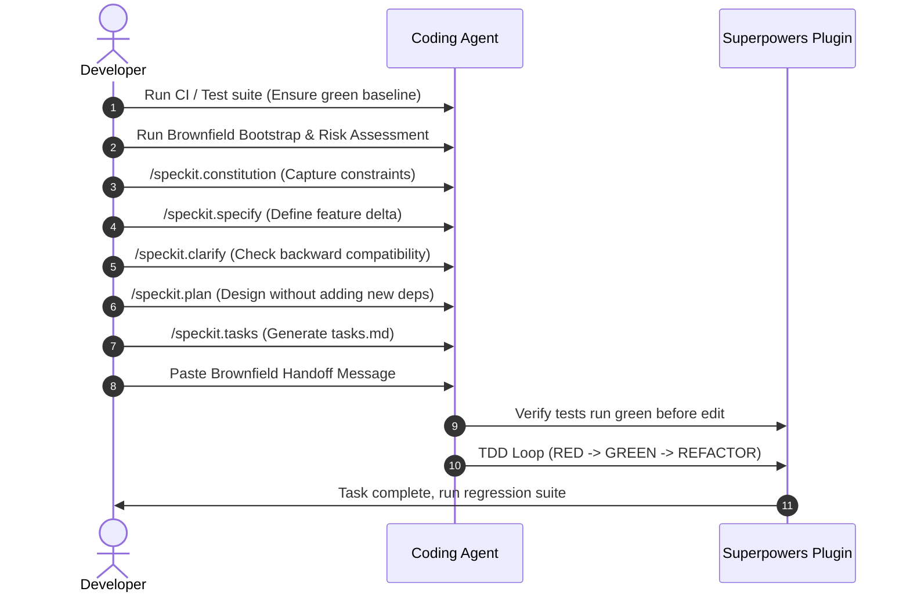

# Brownfield Workflow Guide

Brownfield development is modifying, expanding, or fixing an existing codebase. The critical priority in brownfield development is **safety**—ensuring new features do not regress existing functionality, database migrations are backwards-compatible, and new code respects the established architecture.

---

## 🗺 Brownfield Workflow Overview



---

## 🚀 Step-by-Step Command Sequence

### Step 0: Confirm the Baseline
Before running any Spec-Kit or Superpowers commands, run the codebase's existing tests.

```bash
# Example test run commands
npm test
# OR
pytest
```

> [!WARNING]
> If any existing tests fail, **STOP**. You must fix the baseline or resolve environment issues before starting. Implementing a feature on top of a broken codebase makes it impossible for AI agents to verify their own changes.

---

### Step 1: Bootstrapping & Setup
If this is your first time adoption on the repository, run the bootstrapper to let the agent auto-discover the architecture:

```
/brownfield-bootstrap
```
*This scans folders, locates testing frameworks, and outputs configuration details.*

Next, run the risk assessment tool to identify fragile modules:
```
/brownkit
```
*Produces a risk profile listing protected files (e.g. database migrations, billing handlers) and potential friction points.*

---

### Step 2: Set the Constitution
Capture constraints discovered in Step 1. Save these in `.specify/memory/constitution.md`.
```
/speckit.constitution Capture our existing project constraints:
  - Tech stack: Node.js 20, Express 4.x, PostgreSQL via Knex.js
  - Do not modify: src/database/migrations/ (DBA approval required)
  - Testing: Jest with Supertest for API integration tests
  - Coverage threshold: 80%
  - Branch naming convention: NNN-kebab-slug
```

---

### Step 3: Specify the Change (As a Delta)
Describe the feature not as a greenfield application, but as a change to the current system.
```
/speckit.specify Add user authentication using JWT tokens.
Extend the existing User model schema.
Users log in by POSTing email/password to /auth/login.
On successful login, return a JWT token in an httpOnly cookie.
On failed login, return 401 without revealing if the email exists.
```
*Creates: `.specify/specs/001-user-auth/spec.md`*

---

### Step 4: Run Clarification Q&A
Focus questions on backward-compatibility, token expiry, database migration scripts, and SDK behaviors.
```
/speckit.clarify
```

---

### Step 5: Plan within Constraints
Specify that the agent must use the existing db clients and libraries, and must avoid introducing new packages unless approved.
```
/speckit.plan Use existing libraries (bcryptjs, jsonwebtoken) already in package.json.
```
*Creates: `.specify/specs/001-user-auth/plan.md`*

---

### Step 6: Generate Tasks
```
/speckit.tasks
```
*Creates: `.specify/specs/001-user-auth/tasks.md`*

---

## 🤝 The Handoff (Launching Superpowers)

Paste this specific brownfield handoff message into your coding agent's chat interface. The key instruction is to **verify the baseline passes before modifying any files**.

```text
Use the implementation plan in:
  .specify/specs/001-user-auth/tasks.md

Constraints:
  - Do not generate a new plan
  - Do not create a new git branch (already created by Spec-Kit as 001-user-auth)
  - Verify that all existing tests pass BEFORE touching any files
  - Follow the tech stack and protected modules in .specify/memory/constitution.md
  - Do not introduce new dependencies without explicit approval
  - All changes must be backward compatible
```

---

## 📝 Real-World Example: Express.js JWT Auth

Here is how the Spec-Kit files map to the existing Express app structure:

### 1. Specification (`spec.md`)
```markdown
# Spec: Express JWT Authentication

## Delta Definition
- Add `/auth/login` endpoint (POST).
- Modify user schema to support hashed passwords.
- Protect existing `/api/users/profile` using an authentication middleware.

## Acceptance Criteria
- **Given** a user exists with email `test@test.com` and password `password123`, **when** I POST `{"email": "test@test.com", "password": "password123"}` to `/auth/login`, **then** the response status is 200 and a cookie named `token` is present in the response headers.
- **Given** I call a protected API route without a valid cookie, **when** I make a GET request to `/api/users/profile`, **then** the response status is 401.
```

### 2. Technical Plan (`plan.md`)
```markdown
# Plan: Express JWT Authentication

## Pre-Flight Risk Check
- Modifying `src/models/User.js` could break existing user creation scripts.
- Verification: Keep password hashing optional/backward-compatible during schema migration.

## Proposed Code Changes
- [NEW] `src/middleware/auth.js` - JWT validation middleware.
- [NEW] `src/controllers/authController.js` - Login handler.
- [MODIFY] `src/models/User.js` - Add helper method `comparePassword()`.
- [MODIFY] `src/app.js` - Import and register auth routes.
```

### 3. Checklist (`tasks.md`)
```markdown
- [ ] Task 1: Write integration tests in `tests/auth.test.js` to assert login endpoint failures.
- [ ] Task 2: Implement password comparison on the User model.
- [ ] Task 3: Implement `/auth/login` route controller and token cookie generation.
- [ ] Task 4: Write unit tests for the JWT authentication middleware.
- [ ] Task 5: Implement `auth.js` middleware.
- [ ] Task 6: Apply middleware to protect `/api/users/profile` and write integration tests.
```

---

## 🛡️ Post-Implementation Safety Gate

In brownfield projects, we use **Ripple** to scan for hidden coupling. After all tasks in `tasks.md` are marked green, run this step:

```
/ripple
```

The Ripple extension will analyze the files you changed (`User.js`, `app.js`, etc.) and find dependent modules that weren't touched but might break (e.g. user seed scripts, admin dashboard pages, billing routes). This ensures 100% confidence before merging.

---

### 📖 Next Steps
- Review the 20 Curated Extensions: [Extensions Guide](./extensions.md)
- Set up the AI-Native flywheels: [AI Governance Guide](./governance.md)
- Get set up in 5 minutes: [Quickstart Guide](../QUICKSTART.md)
