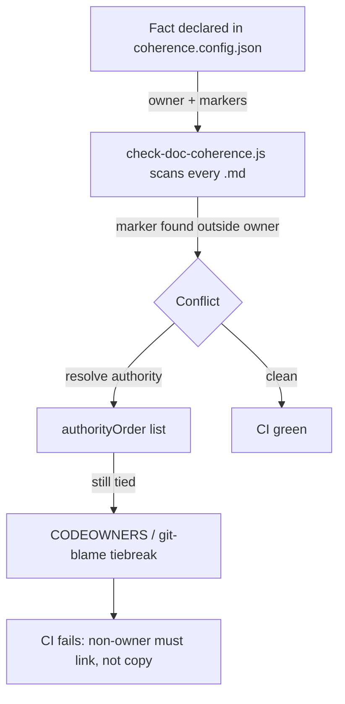

# Context Engineering — applying the 6 Context-Engine principles

Naive RAG and tool-pipes treat each source as an isolated bucket: retrieve a chunk, paste it into the window, hope it was the right one. A *real* context engine reasons across the whole corpus, resolves contradictions, and returns only what the agent needs. This repo is a docs-and-governance repo, not a live retrieval engine — but the docs **are** a context corpus, and a corpus that contradicts itself is worse than no corpus at all. This doc maps the six context-engine principles onto what a static repo can honestly enforce, and is blunt about where the line is.

---

## 🧭 The 6 principles

1. **Unified system context** — reason across the entire corpus and every system of record at once (code, tickets, chat, docs), not one isolated store at a time.
2. **Targeted retrieval** — search exhaustively. The failure mode is the "satisfaction of search" trap: stopping at the first plausible hit and missing the better or contradicting one further down.
3. **Conflict resolution / truthiness** — when two sources disagree (source code vs. a Slack thread from leadership), settle it deterministically. Authority — who said it, in what role — is what breaks the tie; a social graph encodes that authority.
4. **Secure access model** — honor existing permissions and data governance. An agent sees only what the requesting user is authorized to see, nothing more.
5. **Personalized relevance** — tailor context to the specific user: their role, who they collaborate with, their PR and review history. A social graph drives this.
6. **Token optimization** — never stuff the window. Reason across the corpus, then compress to a token-optimized response containing exactly what the agent needs and nothing it doesn't.

---

## 🗺️ How this cookbook applies them

| # | Principle | Repo mechanism | Status |
|---|---|---|---|
| 3 | Conflict resolution / truthiness | The new `doc-coherence` skill: a single-source-of-truth registry ([`templates/coherence.config.json`](../templates/coherence.config.json)) plus a deterministic CI gate ([`scripts/check-doc-coherence.js`](../scripts/check-doc-coherence.js)) that flags when one doc restates a fact another doc owns. Authority is resolved by a declared `authorityOrder`, with a [`.github/CODEOWNERS`](../.github/CODEOWNERS) / git-blame tiebreak — the repo-native analog of the talk's "social graph for authority". | **NEW — implemented now** |
| 6 | Token optimization | [CLAUDE.md §T "Token Efficiency"](../CLAUDE.md): a lazy load order (constitution → tasks → spec → targeted src reads), targeted reads over full-file reads, tables and bullets over prose. | exists |
| 2 | Targeted retrieval | CLAUDE.md §T: "grep/ripgrep first, then read the match ±20 lines" and "do not read every file upfront." Partial — it's guidance, not an enforced search policy. | partial |
| 1 | Unified context | The [`docs/`](./) directory plus the [README](../README.md) routing table give one navigable corpus, and [AGENTS.md](../AGENTS.md) points every agent at CLAUDE.md as the single entry. True cross-system unification (chat, tickets, code) needs a live engine and is out of scope. | partial |
| 4 | Secure access | **Out of scope** — needs a live engine with per-user auth. The only repo-level access signal is [`.github/CODEOWNERS`](../.github/CODEOWNERS). | N/A here |
| 5 | Personalized relevance | **Out of scope** — needs a live social graph keyed to a specific user. | N/A here |

Two of these matter most for a docs repo, and they are the two it can actually enforce rather than merely advise.

**Principle 3** is the one that bites in practice. Documentation drift is silent: every file still parses, every link still resolves, the build stays green — and yet two files now assert different versions of the same fact. A human only finds out when an agent confidently acts on the stale one. The doc-coherence gate makes "who owns this fact" an explicit, machine-checkable declaration rather than tribal knowledge, so the contradiction fails CI instead of reaching an agent.

**Principle 6** is the cheapest, highest-leverage win available to any repo. The load order in CLAUDE.md §T is context engineering applied to the agent's own reading: pull the authority files first, read line ranges instead of whole files, and answer in tables. It costs nothing to encode and compounds on every session.

---

## ⚖️ The conflict-resolution problem, concretely

Picture an "architectural artifacts" effort: an architecture decision record, a system-design doc, and a service README all describe the same component. Over months they drift. The ADR says the service is event-driven; the README still describes the old synchronous call path; the design doc splits the difference. Every file is valid markdown, every cross-link resolves, nothing is "broken" — so nothing flags it. An agent asked "how does this service talk to its dependencies?" retrieves whichever file it hits first and answers with full confidence. That is principle 3 failing in a repo with zero live infrastructure.

[CLAUDE.md §8](../CLAUDE.md) already states the convention: each fact has one canonical home, and other docs **point** to it instead of restating it. As prose, that's a good intention nobody enforces. The doc-coherence registry turns it into a gate:

The registry names a canonical `owner` for each fact and a set of `markers` — the definition phrases that may live in exactly one place. When a marker shows up in a non-owner file, the gate fails the build and tells the author to replace the copy with a link. `authorityOrder` ranks the sources (constitution first, then README, then CLAUDE.md, and so on) so precedence is never ambiguous, and the `CODEOWNERS` / git-blame tiebreak resolves the rest. That ordered authority list plus ownership metadata is the repo-native stand-in for the talk's social graph: it answers "whose version wins" deterministically, in CI, without a human in the loop.

The point is not to ban a topic from appearing in two docs — it's to ban two docs from *independently defining* it. One owns the definition; everyone else references it. Drift then becomes impossible to commit silently.

---

## 🚧 What's intentionally out of scope

A docs-and-governance repo can enforce the corpus-coherence slice of context engineering. It cannot do the parts that require a running system with identity and live data:

- **Principle 4 (secure access)** — there is no per-user auth surface here. `.github/CODEOWNERS` is the only access signal, and it governs review approval, not retrieval-time visibility.
- **Principle 5 (personalized relevance)** — no social graph keyed to a live user, so no per-person tailoring of what gets surfaced.
- **The cross-system half of Principle 1** — unifying chat, tickets, and source into one reasoning surface needs connectors and a retrieval layer this repo deliberately does not own.

Naming these as boundaries is itself the honest version of principle 3: don't let the doc imply a capability the repo doesn't have.

---

## 🧭 Next Steps

- [Doc Coherence Skill](./doc-coherence.md) — the registry schema, the CI gate, and how to declare a fact's owner.
- [AI Governance & Observability](./governance.md) — the broader flywheel this gate plugs into.
- [Back to the main README](../README.md) — the routing table and canonical entry point for the corpus.
