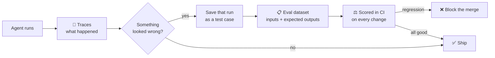

# Evaluation & Observability — knowing whether the agent did a good job

Linting proves your code is tidy. Tests prove your code behaves. Neither tells you whether the *model's output* was any good.

This guide explains the two things that do: **observability** (what happened) and **evaluation** (whether it was good). It assumes no prior AI experience.

> **The one-sentence version:** a trace shows you what the agent did; an eval scores whether it did it well. Most teams build the first and skip the second, then wonder why quality drifts.

---

## 🔍 The two are not the same thing

This confuses almost everyone at first, so here it is plainly:

| | **Observability** | **Evaluation** |
| :--- | :--- | :--- |
| Question it answers | "What did the agent do?" | "Was the answer correct?" |
| What you get | Traces, token counts, latency, cost | A score per test case |
| When it runs | Every single run, in production | On a fixed set of examples, in CI |
| Tells you a change made things worse? | ❌ No | ✅ Yes |
| Analogy | Server logs | The test suite |

You need both, and you need them in that order — you cannot evaluate what you cannot see.



That loop — **notice a bad run in your traces, turn it into a permanent test case** — is the whole practice. Everything below is detail.

---

## 📡 Part 1 — Observability: seeing what the agent did

### What a trace contains

One agent run produces one **trace**. Inside it are **spans** — one per step. A typical trace looks like:

```text
TRACE  "add pagination to the users endpoint"        4.2s  ·  $0.031
├── span  model call        1.1s   1,840 in / 220 out tokens
├── span  tool: read_file   0.1s   src/routes/users.ts
├── span  tool: grep        0.2s   "findMany"
├── span  model call        1.6s   3,100 in / 480 out tokens
└── span  tool: edit_file   0.3s   src/routes/users.ts
```

From this you can answer: where did the time go, where did the money go, which tool call returned garbage, and at which step did the agent go off track.

### OpenTelemetry GenAI — the emerging standard

**OpenTelemetry (OTel)** is the long-established, vendor-neutral standard for traces and metrics. It now has a set of **GenAI semantic conventions**: agreed attribute names for AI-specific things, all prefixed `gen_ai.*`.

| Attribute | Records |
| :--- | :--- |
| `gen_ai.operation.name` | What kind of call it was, e.g. `chat` |
| `gen_ai.request.model` | Which model you asked for |
| `gen_ai.usage.input_tokens` | Tokens sent |
| `gen_ai.usage.output_tokens` | Tokens returned |
| `gen_ai.tool.name` | Which tool the agent invoked |

The practical benefit is that your agent traces land in the **same** backend as the rest of your system's traces, so one dashboard covers everything.

> [!WARNING]
> **These conventions are not stable yet.** As of mid-2026 the `gen_ai.*` attributes are still marked **Development** in the OpenTelemetry registry, not Stable. Blog posts claiming they "went stable" are wrong. Adopt them — they are clearly where the industry is heading — but expect attribute names to change, and do not hard-code them in a hundred places. Wrap them in one helper module you can update once.

---

## 📋 Part 2 — Evaluation: scoring whether it was good

### Start with a golden dataset

An **eval dataset** (often called a *golden dataset*) is just a list of inputs paired with what a good answer looks like. Start with ten to twenty cases. Ten real cases beat a thousand invented ones.

```json
[
  {
    "id": "refund-policy-01",
    "input": "How long do I have to return an item?",
    "expected_contains": ["30 days"],
    "must_not_contain": ["90 days", "no returns"]
  },
  {
    "id": "refund-policy-02",
    "input": "Can I return a gift without a receipt?",
    "expected_contains": ["store credit"],
    "must_not_contain": ["cash refund"]
  }
]
```

Where do the cases come from? From your traces. Every time a run goes wrong, save it. Your dataset grows out of real failures, which are exactly the failures worth preventing.

### Pick the cheapest scorer that works

Scorers come in three levels. **Always try the cheapest one first.**

```text
LEVEL 1 — DETERMINISTIC          fast · free · exact
  ├─ exact match, substring, regex, valid JSON, schema check
  └─ use for: formats, required facts, forbidden phrases
        ↓ only if Level 1 genuinely cannot express the check
LEVEL 2 — STATISTICAL            fast · free · fuzzy
  ├─ similarity to a reference answer, keyword overlap
  └─ use for: "roughly the same meaning"
        ↓ only if Level 2 genuinely cannot express the check
LEVEL 3 — LLM-AS-JUDGE           slow · costs money · needs calibration
  ├─ a second model reads the answer and scores it
  └─ use for: tone, helpfulness, reasoning quality
```

Most people reach straight for Level 3 because it feels powerful. It is also slow, expensive, and — critically — **it can be wrong**. A regex that checks the answer contains "30 days" is free, instant, and never has an opinion.

### Calibrating an LLM judge

If you do need a judge, you must check the judge before you trust it. Judges are systematically **optimistic** — they hand out good scores too readily.

The calibration procedure:

1. Take about 50 outputs from your dataset.
2. Have a **human** label each one pass or fail. This is the tedious part. Do it anyway.
3. Run the judge on the same 50.
4. Compare. How often does the judge agree with the human?
5. If agreement is poor, fix the *judge's* prompt — not your product — and repeat.

> [!IMPORTANT]
> An uncalibrated judge does not measure quality. It measures the judge. If you have never compared it against human labels, you do not know which one you have.

Two things that reliably improve a judge:

- **Ask for a binary verdict, not a 1–10 score.** "Does this answer state the correct return window? pass/fail" is far more stable than "rate the quality from 1 to 10."
- **Give it the rubric and a worked example of a fail.** Judges drift without one.

---

## 🛠️ The tooling landscape

You do not need all of these. Pick one from each column.

| Need | Common open-source options | Notes |
| :--- | :--- | :--- |
| Traces + cost dashboard | **Langfuse**, **Arize Phoenix** | Both self-hostable. Langfuse is the usual default for a team that wants to run its own. |
| Evals in CI | **promptfoo**, **DeepEval** | promptfoo is config-file driven and slots into a CI job easily. DeepEval follows a pytest-style API. |
| One API across model providers | **LiteLLM** | A gateway that also gives you per-key cost tracking. Useful even if you only use one provider today. |

> [!NOTE]
> **New dependency policy.** Per [CLAUDE.md §7](../CLAUDE.md), adding any of these to a project governed by this cookbook requires a PR describing the dependency and its purpose, with maintainer approval. Do not install one mid-task.

---

## 🚦 Where this fits in this cookbook's gates

This repository already defines four verification gates in
[`.ai/config/VERIFICATION_AND_EVAL_GUIDE.md`](../.ai/config/VERIFICATION_AND_EVAL_GUIDE.md).
That file is the single owner of gate definitions — this guide does not redefine them.

If your project builds an LLM-powered feature, the eval suite belongs in **Gate 1** alongside the other automated checks, because it is exactly that: an automated check that either passes or fails.

```text
GATE 1 — Automated Checks
  ├─ lint            ← already there
  ├─ tests           ← already there
  ├─ secret scan     ← already there
  └─ eval suite      ← add this when your project calls a model
```

Two rules that keep it useful:

- **Set a threshold, not a vibe.** "Pass rate must not drop below the last release" is a gate. "Looks fine" is not.
- **A failing eval blocks the merge**, the same as a failing unit test. If it does not block, it will be ignored within two weeks.

---

## 🖥️ Running evals on each platform

Eval runs are ordinary CLI commands, but the shell differences still bite. Two things trip people up on Windows: setting an environment variable, and quoting JSON.

**Setting an API key for one command:**

```bash
# macOS and Linux
export MY_PROVIDER_API_KEY="sk-..."
npx promptfoo@latest eval
```

```powershell
# Windows (PowerShell)
$env:MY_PROVIDER_API_KEY = "sk-..."
npx promptfoo@latest eval
```

```text
:: Windows (cmd.exe)
set MY_PROVIDER_API_KEY=sk-...
npx promptfoo@latest eval
```

> [!TIP]
> Keep the API key out of your shell history and out of git. Put it in your CI provider's secret store, and locally in a `.env` file that is listed in `.gitignore`. Never paste a key into `AGENTS.md`, a `SKILL.md`, or a prompt — all three end up in a model's context.

**One more Windows gotcha: line endings.** If your eval compares model output against expected text stored in a file, a Windows checkout can silently introduce `\r\n` line endings and cause mismatches that look impossible to debug. Add a `.gitattributes` file at your repo root with this single line, and the problem disappears on all three platforms:

```text
* text=auto eol=lf
```

---

## 🎨 See it visually

The [Interactive Cookbook Explorer](https://exponen-agi.github.io/ai-engineering-cookbook/design/cookbook-explorer.html) shows the evaluation and observability layers alongside the agent standards in its **The 2026 Stack** section.

---

## 🧭 Next Steps

- [Agent Standards](./agent-standards.md) — AGENTS.md, Skills, and MCP explained.
- [AI Governance & Observability](./governance.md) — the reflection logs and postmortem flywheel this plugs into.
- [Context Engineering](./context-engineering.md) — deciding what goes into the agent's context.
- [Glossary](../GLOSSARY.md) — plain-English definitions for every term used here.
- [Back to the main README](../README.md).
