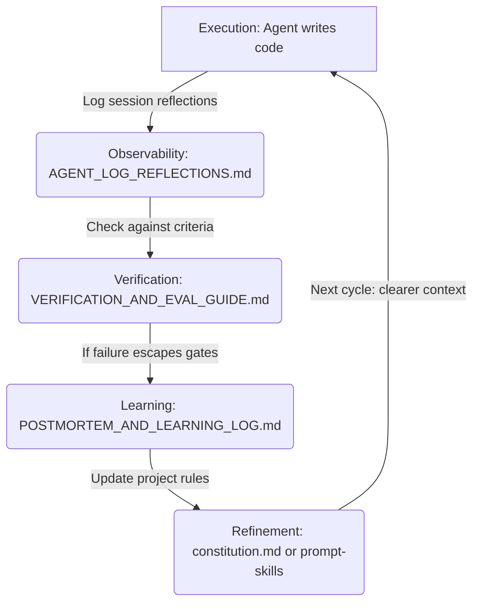
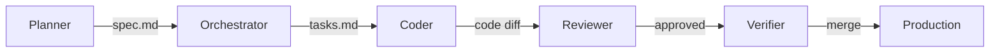

# AI-Native SDLC Governance and Observability

A major challenge in AI-native engineering is that **AI amplifies bad decisions as fast as it implements good ones.** Without structure, agents make undocumented design assumptions, bypass testing, and introduce technical debt. 

The **AI-Native SDLC Framework** adds a governance, alignment, and observability layer on top of Spec-Kit and Superpowers. It ensures every execution session is tracked, failures lead to systematic learning rather than blame, and the development pipeline gets measurably smarter with each feature built.

---

## 🔄 The Continuous Improvement Flywheel

The core of our governance framework is a feedback loop designed to catch errors, identify root causes, and refine prompt-skills/guidelines to prevent recurrence.

---

## 🕵️‍♂️ The Observability Layer

We use two primary files to record execution and track failures. These files should be treated as the project's source of truth for engineering velocity and quality.

### 1. The Agent Execution Journal (`.ai/traces/AGENT_LOG_REFLECTIONS.md`)
Agents append to this log automatically after **every implementation session** (before committing a task). It captures immediate developer friction.

- **Outcome**: `COMPLETE`, `PARTIAL`, or `BLOCKED`.
- **Frictions**: Where the agent had to make assumptions (e.g. "Spec didn't specify token expiry time").
- **Suggested Refinements**: Proposed prompt updates or rule adjustments.

### 2. The Blameless Postmortem Log (`postmortems/POSTMORTEM_AND_LEARNING_LOG.md`)
Humans and Verifier agents create entries here only when **a bug escapes normal test gates** and reaches staging or production.

- **Philosophy**: Postmortems are 100% blameless. The goal is to identify the system failure, not the person or agent who caused it.
- **Root Cause Analysis**: Did the spec lack detail? Was the test gate too weak? Did the prompt-skill fail to encode constraints?
- **Action Item**: Every postmortem must result in a concrete update to a verification gate, the constitution, or a plugin prompt-skill.

---

## 👥 Multi-Agent Pod Structure

In automated pipelines, we partition the AI workload into five distinct agent roles. This prevents context bleed and ensures checks and balances.

### Role Breakdown

| Role | Primary Responsibility | Input File(s) | Output File(s) | Key Command/Skill |
| :--- | :--- | :--- | :--- | :--- |
| **Planner** | Spec authoring & clarification | User Request | `spec.md` | `/speckit.specify`, `/speckit.clarify` |
| **Orchestrator** | Handoff & workflow routing | `spec.md`, `tasks.md` | Handoff message | `/speckit.tasks` |
| **Coder** | TDD Implementation (RED ➔ GREEN ➔ REFACTOR) | `tasks.md`, `spec.md` | Source code + Unit tests | `subagent-driven-development` |
| **Reviewer** | Spec compliance & style review | `spec.md`, code diff | APPROVED / BLOCKED | `requesting-code-review` |
| **Verifier** | Automated pre-merge safety checks | `VERIFICATION_AND_EVAL_GUIDE.md` | Check results | `verification-before-completion` |

---

## 🛡️ Verification Gates

All code commits must clear the gates defined in `.ai/config/VERIFICATION_AND_EVAL_GUIDE.md`:

1. **Gate 1 (Automated Checks)**: Zero syntax errors, passing types, passing unit tests, and security secret scanning.
2. **Gate 2 (Spec Compliance)**: Direct verification that every acceptance criterion in `spec.md` is covered by a test and implemented.
3. **Gate 3 (Human Review Triggers)**: Pause and ask for human confirmation if a protected path is modified, a new npm dependency is introduced, or coverage drops.
4. **Gate 4 (Final Pre-Merge)**: Verification checklist prior to branch deletion and merge (e.g. no secrets staged, log entries completed).

By codifying these verification gates, the AI is constrained to execute safely and productively, protecting the codebase from regression.

---

### 📖 Next Steps
- Group by phase and configure helper tools: [Extensions Guide](./extensions.md)
- Set up your local machine: [Installation Guide](./installation.md)
- Review the CLI cheatsheet: [Quickstart Guide](../QUICKSTART.md)
