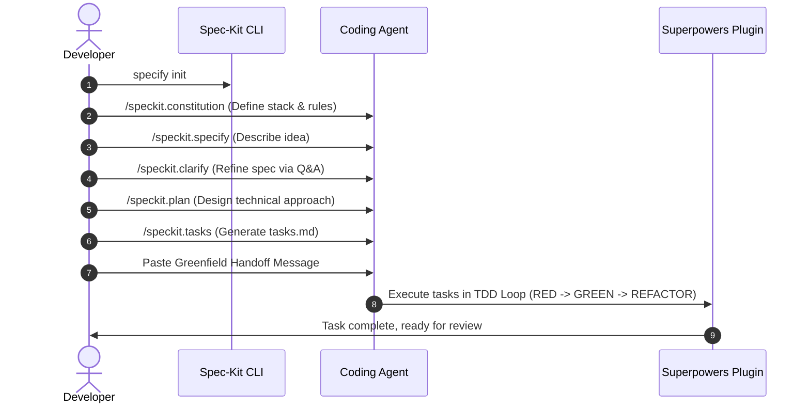
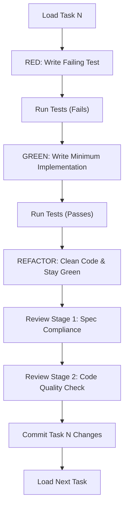

# Greenfield Workflow Guide

Greenfield development is starting a brand-new project or feature from scratch in an empty directory. Since there are no legacy files or pre-existing tests to protect, the focus is on defining the tech stack, establishing clean architecture patterns, and using Test-Driven Development (TDD) from day one.

---

## 🗺 Greenfield Workflow Overview



---

## 🚀 Step-by-Step Command Sequence

### Step 1: Initialize the Project
Create a blank directory and initialize Spec-Kit:
```bash
mkdir expense-tracker
cd expense-tracker
specify init . --integration claude
```

### Step 2: Set the Project Constitution
Define the tech stack, rules, and folder structure. Spec-Kit will write this to `.specify/memory/constitution.md`.
```
/speckit.constitution Create principles for an expense tracker:
  - Tech stack: Next.js 14 (App Router), TypeScript, Tailwind CSS, Prisma with SQLite
  - Testing: Vitest and React Testing Library
  - Minimum test coverage: 80%
  - Currency rule: Store all currency amounts as integers (cents), never floats.
```

### Step 3: Write the Specification
Describe the user-facing feature. Do not mention technical code details yet; focus on *what* the application does.
```
/speckit.specify Build a simple expense tracker dashboard.
Users can add an expense with an amount, category, date, and description.
Users can view a list of expenses sorted by date (newest first).
Users can filter expenses by category.
Show a running total of the visible expenses.
```
*Creates: `.specify/specs/001-expense-tracker/spec.md`*

### Step 4: Run Clarification Q&A
Let Spec-Kit analyze the spec and ask clarifying questions to remove assumptions.
```
/speckit.clarify
```
*Example Interaction:*
> **Spec-Kit**: What are the pre-defined categories? Or can users create custom ones?  
> **You**: Use a pre-defined list: Food, Rent, Transport, Entertainment, Utilities, Other.  
> **Spec-Kit**: Should the database persist data locally?  
> **You**: Yes, use a local SQLite database through Prisma.

### Step 5: Generate the Technical Plan
Now that the features and constraints are crystal clear, write the plan showing exactly which files will be created or modified.
```
/speckit.plan
```
*Creates: `.specify/specs/001-expense-tracker/plan.md`*

### Step 6: Generate Tasks
Convert the technical plan into a checkbox checklist.
```
/speckit.tasks
```
*Creates: `.specify/specs/001-expense-tracker/tasks.md`*

---

## 🤝 The Handoff (Launching Superpowers)

Once `tasks.md` is generated, paste the following handoff message into your coding agent's chat interface. This tells Superpowers to begin coding without regenerating the plan.

```text
Use the implementation plan in:
  .specify/specs/001-expense-tracker/tasks.md

Constraints:
  - Do not generate a new plan
  - Do not create a new git branch (already created by Spec-Kit)
  - Follow the tech stack defined in .specify/memory/constitution.md
  - Write tests before implementation code (TDD)
  - All tasks must pass the two-stage review (spec compliance first, code quality second)
```

---

## 📝 Real-World Example: Next.js Expense Tracker

Here is what the Spec-Kit files look like for this project:

### 1. Specification (`spec.md`)
```markdown
# Spec: Expense Tracker Dashboard

## User Stories
- **As a User**, I want to record an expense so that I can track my spending.
- **As a User**, I want to filter my expenses by category so that I can see where my money goes.

## Acceptance Criteria
- **Given** I am on the dashboard, **when** I enter an amount of 10.50, select "Food", and submit, **then** a new expense is saved in the database with 1050 cents.
- **Given** I have saved expenses, **when** I view the dashboard, **then** they are sorted by date (newest first).
- **Given** expenses in categories "Food" ($10) and "Rent" ($100), **when** I filter by "Food", **then** I only see the Food expense, and the running total displays "$10.00".
```

### 2. Technical Plan (`plan.md`)
```markdown
# Plan: Expense Tracker Dashboard

## Proposed Database Schema
- **Expense Model**: `id` (UUID), `amount` (Int - cents), `category` (String), `date` (DateTime), `description` (String)

## Proposed Files
- `prisma/schema.prisma` - Database schema definition.
- `src/lib/db.ts` - Database client initialization.
- `src/components/ExpenseForm.tsx` - Input component for adding expenses.
- `src/components/ExpenseList.tsx` - List and filter display component.
- `src/app/page.tsx` - Main page combining form, list, and totals.
```

### 3. Checklist (`tasks.md`)
```markdown
- [ ] Task 1: Setup Prisma schema with Expense model and run migrations.
- [ ] Task 2: Implement database client helper and seed script.
- [ ] Task 3: Write unit tests for expense CRUD helper functions.
- [ ] Task 4: Implement expense CRUD helper functions.
- [ ] Task 5: Build ExpenseForm component with client-side validation.
- [ ] Task 6: Build ExpenseList and CategoryFilter components.
- [ ] Task 7: Integrate components into the main page with state management.
- [ ] Task 8: Add end-to-end integration tests using Vitest.
```

---

## 🔄 The TDD Execution Loop

For each task in `tasks.md`, Superpowers spawns a subagent to run the TDD loop:



By following this sequence, you ensure that every line of code generated has a corresponding test and is directly mapped to an approved specification.

---

### 📖 Next Steps
- Learn how to work in existing codebases: [Brownfield Guide](./brownfield.md)
- Learn how to use community extensions: [Extensions Guide](./extensions.md)
- Set up automated quality gates: [AI Governance Guide](./governance.md)
